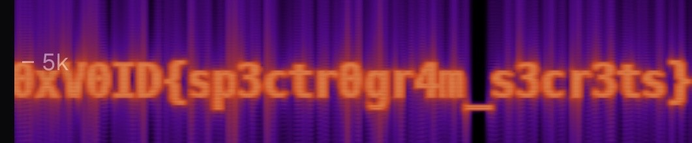

##  [250pt]A_Simple_Spectrum

We intercepted this audio file from a deep-space relay station. It sounds like static to our analysts — but our algorithms detected anomalous frequency patterns. Maybe the flag isn't something you hear... it's something you see.

Flagformat : 0xV0ID{}

## Solution

https://neuralanalog.com/online-spectrogramで見る。


## Flag 

```
0xV0ID{sp3ctr0gr4m_s3cr3ts}
```