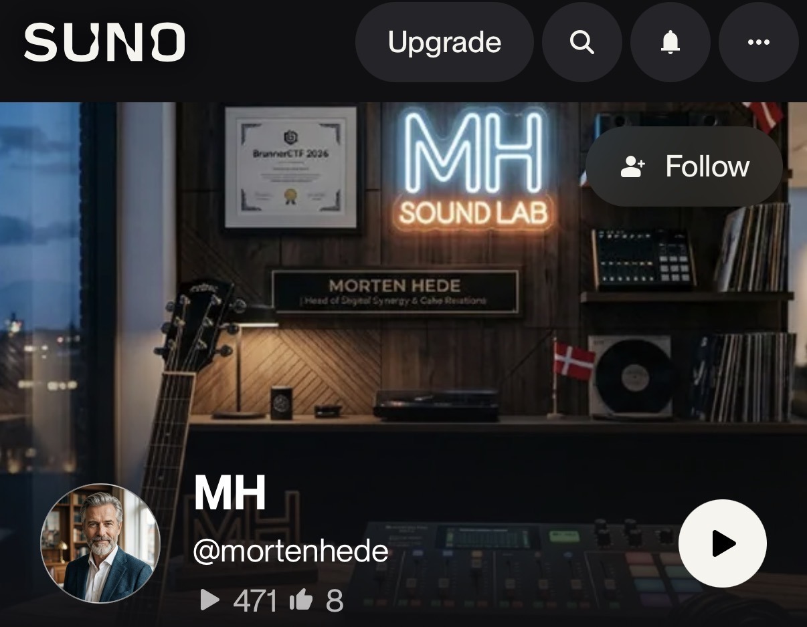
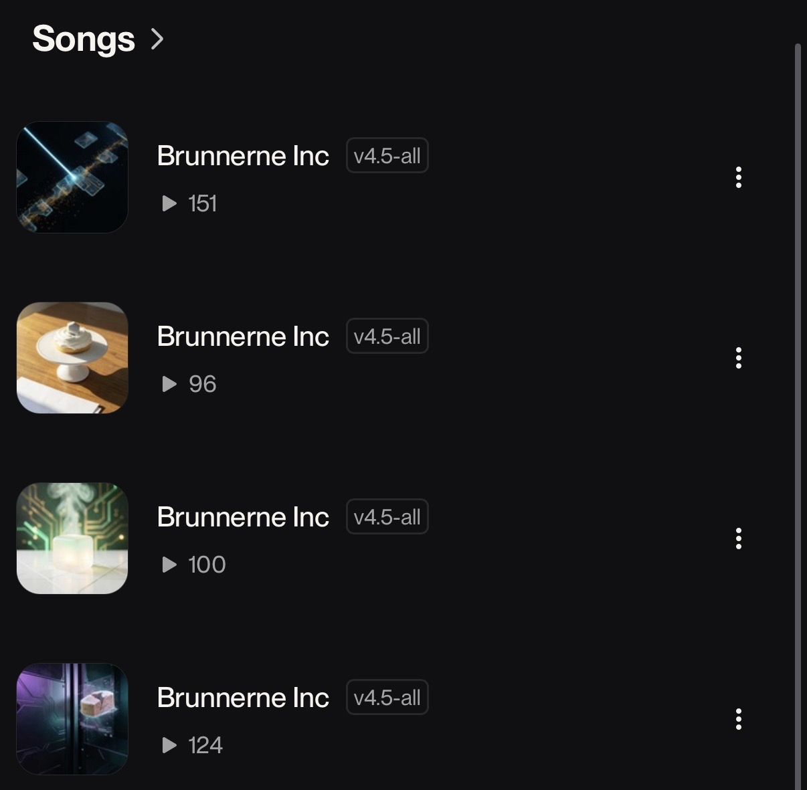
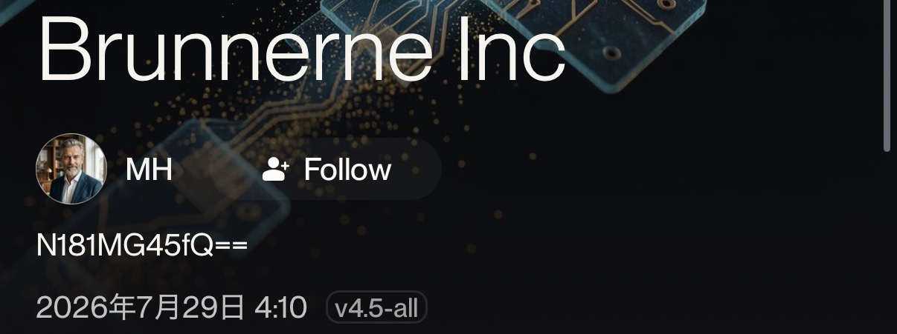
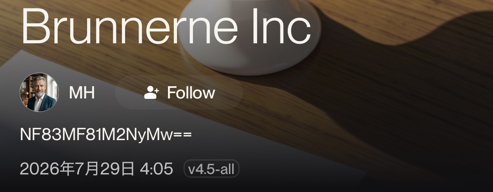
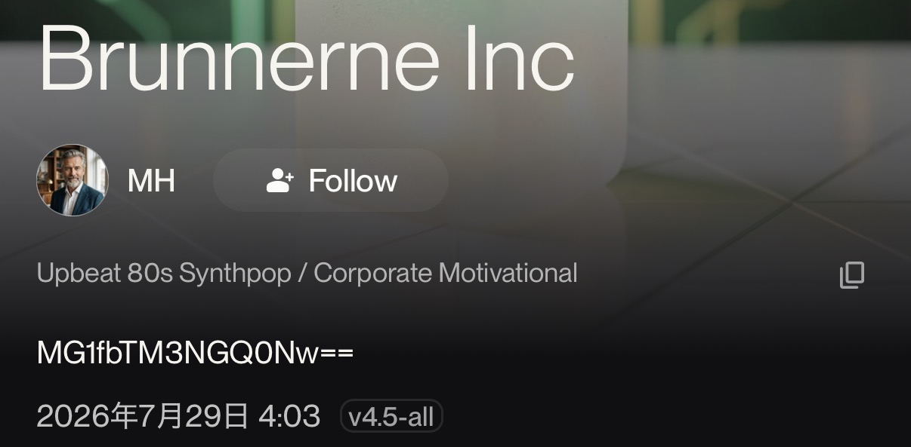
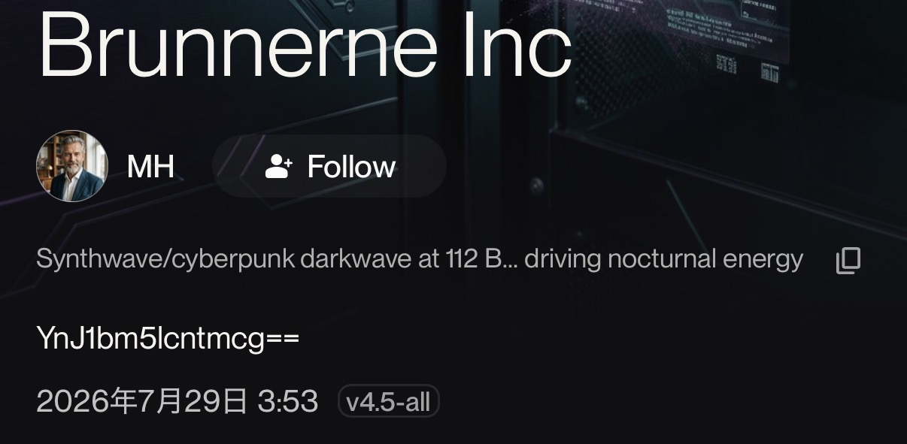

## [100pt][OSINT][Easy]Unknown_Artist

An unknown artist at Brunnerne has been creating some music. The artist has been using a secret platform to hide a flag. Can you find it?

## Solution

```
# strings Brunnerne Inc.mp3
TIT2
Brunnerne Inc
WOAS
https://suno.com/song/b408fe76-c81f-4a96-b10e-b9df4e5d4ec2
USLT
APIC
image/jpeg
Cover
JFIF
(:3=<938
```

URLが書いてあった。
AI音楽生成プラットフォームSunoのページ。

```
https://suno.com/song/b408fe76-c81f-4a96-b10e-b9df4e5d4ec2
```



全部で4曲ある。
曲名は全て同じ。




それぞれ開いてみると、Base64の文字列が書いてあった。

 





```
N181MG45fQ==
NF83MF81M2NyMw==
MG1fbTM3NGQ0Nw==
YnJ1bm5lcntmcg==
```

それぞれデコードする。

```
⁠brunner{fr⁠
⁠0m_m374d47⁠
⁠7_50n9}⁠
⁠4_70_53cr3
```

並び替える。

## Flag

```
brunner{fr0m_m374d474_70_53cr37_50n9}
```