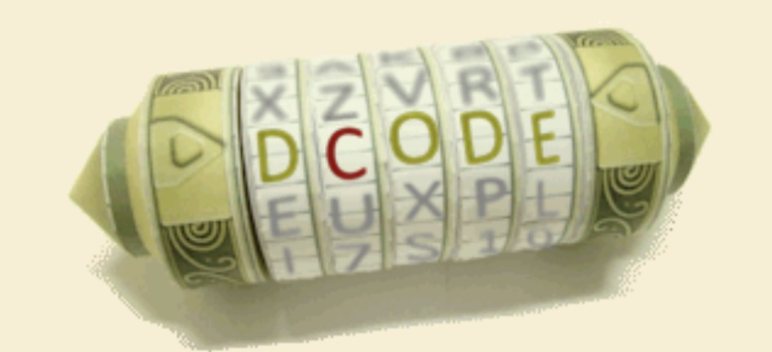
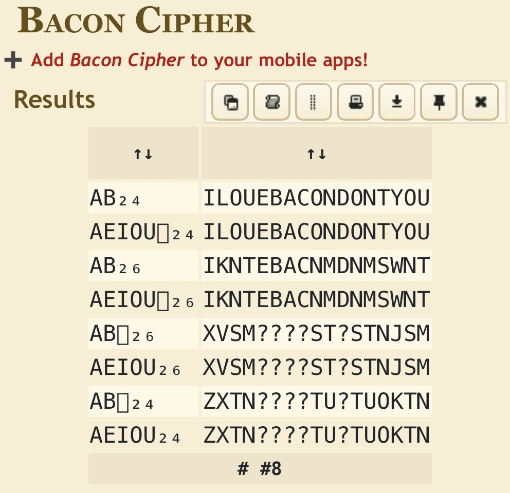

## HyperStream_Test_2

30 points Easy

I love the smell of bacon in the morning! ABAAAABABAABBABBAABBAABAAAAAABAAAAAAAABAABBABABBAAAAABBABBABABBAABAABABABBAABBABBAABB

## Solution

モールス信号に置き換えるのかと思ったらベーコン暗号というらしい。

decodeで解析する。


https://www.dcode.fr/bacon-cipher#f0



## Flag

```
CTFlearn{ILOUEBACONDONTYOU}
```
