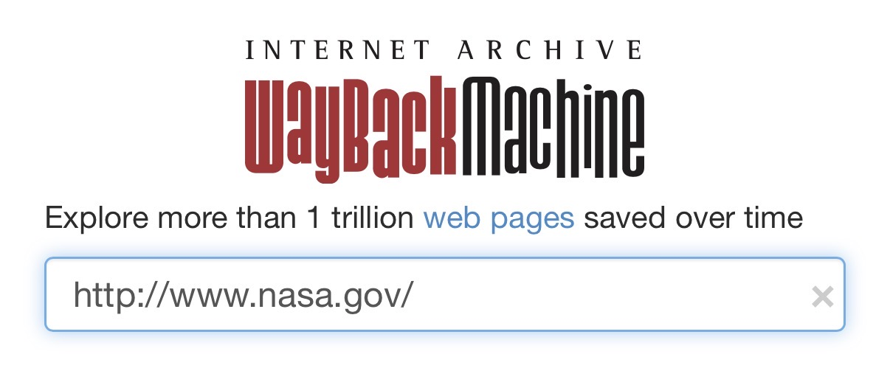
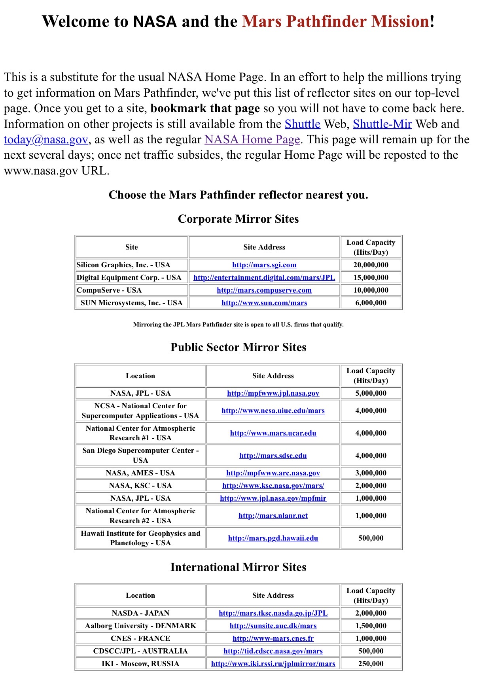
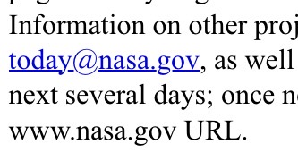

## Time_Traveller

10 points Easy

Let's take a trip to nasa.gov on December 31, 1996. If you can tell me what email NASA listed on their website, I'll provide you with 10 points. Format: CTFlearn{email}

## Solution

Wayback Machineで遡ってみる。
https://web.archive.org

検索
```
http://www.nasa.gov/
```




1996年当時のサイトが表示される。




メールが書いてある。




## Flag


```
CTFlearn{today@nasa.gov}
```