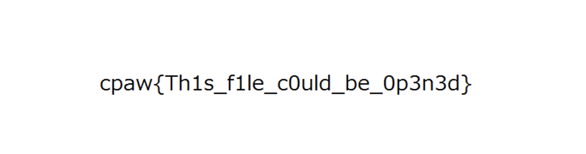

## Q8.[Misc] [10pt]Can_you_open_this_file

このファイルを開きたいが拡張子がないので、どのような種類のファイルで、どのアプリケーションで開けば良いかわからない。  
どうにかして、この拡張子がないこのファイルの種類を特定し、どのアプリケーションで開くか調べてくれ。  
問題ファイル： [open_me](https://ctf.cpaw.site/download.php?param=e44b3198036df7fb047516035ec989e1)

## Solution

```shell
localhost:~# file open_me 
open_me: Composite Document File V2 Document, Little Endian, Os: Windows, Version 10.0, Code page: 932, Author: v, Template: Normal.dotm, Last Saved By: v, Revision Number: 1, Name of Creating Application: Microsoft Office Word, Total Editing Time: 28:00, Create Time/Date: Mon Oct 12 04:27:00 2015, Last Saved Time/Date: Mon Oct 12 04:55:00 2015, Number of Pages: 1, Number of Words: 3, Number of Characters: 23, Security: 0
localhost:~# mv open_me open_me.doc
localhost:~# 
```



## Flag

```
cpaw{Th1s_f1le_c0uld_be_0p3n3d}
```